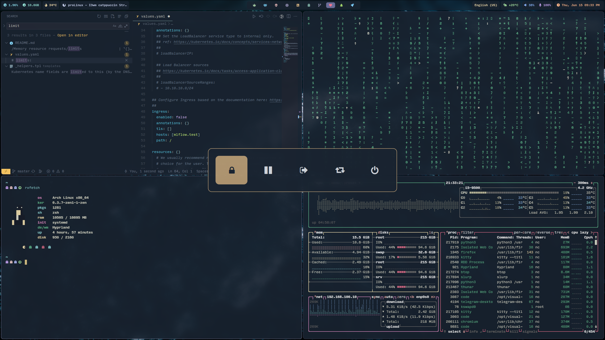

# hyprland-dots

|Distro|[Arch](https://archlinux.org/)|
|:---:|:---:|
|WM|[Hyprland](https://hyprland.org/)|
|Bar|Waybar](https://github.com/Alexays/Waybar)|
|Menu|[Rofi](https://github.com/davatorium/rofi)|
|Terminal|[Kitty](https://github.com/kovidgoyal/kitty)|
|Fetch|[Neofetch](https://github.com/dylanaraps/neofetch)|
|File Manager|[Thunar](https://archlinux.org/packages/extra/x86_64/thunar/)|
|Shell|[Fish](https://github.com/fish-shell/fish-shell)|
|Aur Helper|[Paru](https://github.com/Morganamilo/paru)|

